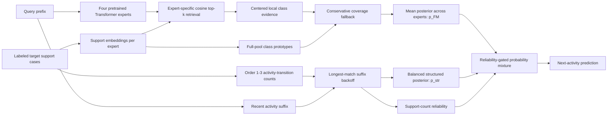

# FM-v3 architecture changes: from FM-v2 to structured FM-v3

This document is the source of truth for the architecture currently selected
for the paper. It explains what changed, why each change was made, which parts
were trained, which parts are inference-only, and which experiments were
rejected. Numerical results live in
[`fmv3_improvement_report.md`](fmv3_improvement_report.md) and
[`structured_fmv3_report.md`](structured_fmv3_report.md).

## Short version

The final system is not the original `06_full_fmv3` model. It has two selected
stages:

1. **Corrected FM-v3 checkpoint:** retain FM-v2's reliable centered local
   decision, use full-pool prototypes only to recover labels absent from the
   local top-k neighborhood, fix temperature and multi-expert retrieval bugs,
   and train primarily on classification with explicit missing-local-label
   episodes.
2. **Structured FM-v3 inference:** combine that neural posterior with a
   class-balanced, target-log transition memory keyed by the last one to three
   activities. The transition branch backs off to shorter contexts and is
   automatically suppressed when its context has little or no support.

The Transformer encoder and its four-expert mixture remain the learned
representation backbone. The structured transition memory adds no target-log
gradient updates and does not change remaining-time prediction.

## Four-stage comparison

| Dimension | FM-v2 baseline | Original full FM-v3 | Corrected FM-v3 | Structured FM-v3 |
|---|---|---|---|---|
| Encoder | Four Transformer experts | Same backbone, continued training | Same backbone, continued from FM-v2 epoch 20 | Frozen corrected epoch-23 checkpoint |
| Local geometry | Neighborhood-centered cosine | Uncentered cosine | Neighborhood-centered cosine restored | Same as corrected FM-v3 |
| Local aggregation | Summed soft-kNN mass | Log-sum-exp with learned count normalization | Log-sum-exp with fixed $\gamma=0$ | Same as corrected FM-v3 |
| Candidate labels | Local top-k only | Full support pool | Full support pool, but global evidence used only for locally missing labels | Neural candidates plus structured transition evidence |
| Global combination | None | Learned/fixed global-local fusion for all classes | Margin-gated coverage fallback | Same fallback inside $p_{FM}$ |
| Class prior | Implicit local frequency | Explicit balanced/natural mode | Balanced | Balanced neural head plus uniform structured class prior |
| Abstention | None | Learned missing-pool abstention | Removed | Removed |
| Target-log adaptation | Embedding retrieval | Embedding retrieval and prototypes | Corrected retrieval and prototypes | Corrected neural memory plus order-1--3 transition memory |
| Target gradients | None | None | None | None |
| Status | Authoritative baseline | Rejected combined design | Selected neural base | **Selected final classifier** |

## Architecture at a glance

The two memory systems are complementary:

- The **embedding memory** transfers similarity learned across source logs and
  can generalize between prefixes that are not exact symbolic matches.
- The **transition memory** enforces the explicit target-process state and
  prevents cosine retrieval from overlooking a well-observed outgoing
  transition.

## What stayed unchanged

The following are not new architectural claims:

- Event prefixes are still encoded by the existing event-native Transformer.
- The learned configuration still uses four independently trained experts.
- Activity identifiers remain **log-local**. An identifier has no shared
  semantic meaning across logs.
- Target adaptation remains gradient-free: target cases populate support
  memories but do not update model weights.
- Remaining time still uses the existing embedding-neighbor regression head.
- The selected structured branch operates only on next-activity
  classification.

This distinction matters: most of the final gain comes from changing how the
target support memory is queried and combined, not from increasing encoder
size or retraining a larger backbone.

## Stage 0: FM-v2 baseline

FM-v2 retrieves a local top-k neighborhood for a query embedding. It centers
the query and retrieved embeddings by the neighborhood mean, computes cosine
similarities, and sums softmax attention mass for examples with the same
label. Only labels present in top-k are candidates.

This design is effective when retrieval contains the correct activity, but it
couples three separate concerns:

1. semantic relevance of examples;
2. reachability of an activity label;
3. frequency of that label among retrieved examples.

If a label exists elsewhere in the target support pool but is absent from the
query's top-k neighborhood, its prediction probability is exactly zero.

Reference configuration:
[`configs/fmv3/00_fmv2.yaml`](../configs/fmv3/00_fmv2.yaml).

## Stage 1: the original full FM-v3 and why it was not selected

The initial `06_full_fmv3` design attempted to decouple local evidence, global
coverage, and class prevalence. It introduced:

- realistic balanced, natural, long-tail, random-shot, rare-path, and
  missing-label episodes;
- count-normalized local evidence;
- full-support class prototypes;
- count-dependent prototype shrinkage;
- fixed and learned global-local gates;
- explicit balanced or natural class priors;
- dynamic retrieval expansion;
- an abstention output for support-pool-unseen labels.

Those are useful ablation concepts, but the combined checkpoint was not a
successful final architecture. Its main problems were both conceptual and
implementation-related:

| Problem | Consequence |
|---|---|
| Learned temperature was disconnected from the FM-v3 evidence paths | `learn_temperature: true` did not change those logits |
| FM-v2 neighborhood centering was silently removed | The comparison changed similarity geometry as well as aggregation |
| Expert 0's neighbor indices were reused for every expert | Experts 1-3 were evaluated with neighborhoods from the wrong embedding space |
| Global-local `logaddexp` fusion modified every class score | Noisy global prototypes could overturn strong local decisions even when no coverage repair was needed |
| Shrinkage, gate, count-normalization, and abstention parameters moved little | Added capacity did not become a reliable adaptive mechanism |
| Missing-pool-label training asked an opaque-label model to predict an unavailable class | The task is information-theoretically impossible without external semantics or constraints |
| Training sampled classification and regression equally | Only half the updates optimized the paper's primary next-activity endpoint |

The historical pre-audit results are retained in
[`fmv3_evaluation_report.md`](fmv3_evaluation_report.md), but that report does
not describe the selected final architecture.

## Stage 2: corrected FM-v3

### 2.1 Reconnected learned temperature

The local and global evidence scales now depend on the learned `logit_scale`:

$$
\operatorname{scale}_{local}
= \frac{\operatorname{clip}(s,1,20)/s_0}{T_{local}},
\qquad
\operatorname{scale}_{global}
= \frac{\operatorname{clip}(s,1,20)/s_0}{T_{global}}.
$$

Here $s$ is the learned scale and $s_0$ is its initialization reference. This
makes the configuration flag and its gradient path agree. The implementation
is in [`components/prototypical_head.py`](../components/prototypical_head.py).

### 2.2 Restored centered local geometry

The selected head uses `local_centering: true`. For retrieved support vectors
$z_i$ and query $q$, it subtracts the local support mean and renormalizes before
computing similarities. Count normalization is fixed at $\gamma=0$, so local
class evidence is

$$
L_c(q)=\log\sum_{i\in\mathcal N_k(q):y_i=c}
\exp\bigl(\operatorname{scale}_{local}\,
\operatorname{cos}(q,z_i)\bigr).
$$

At a matched similarity scale, omitting the common softmax normalizer makes this
the same class score and ordering as FM-v2's summed attention mass. Continued
training may adjust the learned scale, but the local geometry and aggregation
form are restored. The corrected experiment therefore changes candidate
coverage without needlessly replacing a strong local rule.

### 2.3 Made retrieval expert-specific

Each expert now retrieves top-k neighbors using its own query and support
embeddings. The four posterior vectors are aligned to the same target-log class
space and averaged only after each expert has evaluated its own neighborhood.

This is an evaluator correction, but it changes effective model behavior: an
ensemble of different embedding spaces is no longer forced to share expert
0's neighborhood. The batched implementation is in
[`evaluation/fmv3_protocol.py`](../evaluation/fmv3_protocol.py).

### 2.4 Replaced global-local fusion with conservative coverage fallback

Global prototypes are still formed from every labeled support prefix:

$$
\mu_c = \operatorname{normalize}\left(
\frac{1}{N_c}\sum_{i:y_i=c} z_i
\right),
\qquad
G_c(q)=\operatorname{scale}_{global}\,q^\top\mu_c.
$$

However, global evidence no longer perturbs classes already represented in the
local neighborhood. For a locally present class, the final evidence is simply
$L_c$. For a support-covered but locally missing class,

$$
E_c = \max_{j\in C_{local}}L_j
      +G_c
      -\max_{j\in C_{local}}G_j
      -m,
$$

where the selected margin is $m=1.0$. Thus a missing class can win only when
its global prototype exceeds the best locally present prototype by more than
the margin. This makes global memory a **candidate-recovery mechanism**, not a
second classifier that rewrites all decisions.

The selected head disables prototype shrinkage and abstention because neither
was reliably learned in the original full model. A class absent from the
entire target support pool remains unavailable; the model does not pretend to
infer an opaque unseen label.

### 2.5 Changed the training distribution

The corrected continuation uses:

- 80% classification and 20% remaining-time steps, rather than 50/50;
- 25% deliberately constructed `missing_local_label` classification episodes;
- no `missing_pool_label` episodes;
- balanced, natural, long-tail, random-shot, and rare-path episodes for the
  remainder;
- a 5x prototypical-head learning-rate multiplier after warmup.

The classification episode mixture is exactly:

| Episode type | Probability within classification steps |
|---|---:|
| Balanced | 0.25 |
| Natural | 0.15 |
| Long-tail | 0.10 |
| Random-shot | 0.15 |
| Rare-path | 0.10 |
| Missing local label | 0.25 |
| Missing pool label | 0.00 |

In a missing-local-label episode, the query's correct label is removed from its
retrieved local neighbors but remains in the global support pool. This directly
trains the failure mode that coverage fallback can actually solve.

The run continues the common FM-v2 epoch-20 checkpoint. Epoch 23 was selected;
epoch 25 was evaluated and rejected after balanced accuracy began to regress.
The configuration chain is:

1. [`11_corrected_fallback_m05.yaml`](../configs/fmv3/11_corrected_fallback_m05.yaml)
2. [`12_corrected_fallback_m10.yaml`](../configs/fmv3/12_corrected_fallback_m10.yaml)
3. [`corrected_fmv3.yaml`](../configs/fmv3/corrected_fmv3.yaml)

### 2.6 Separated decision temperature from fallback calibration

The selected checkpoint uses ordinary inference temperature 1.0. Queries for
which a globally covered label is missing locally use fallback temperature
0.4. This changes probability sharpness only in the regime where the fallback
candidate set is active; it does not change which evidence sources are
available.

## Stage 3: structured transition memory

### 3.1 Bottleneck after correcting the neural head

Corrected FM-v3 still maps the complete prefix to one generic embedding and
retrieves by cosine similarity. The embedding may consider activities,
resources, costs, and time, but retrieval does not guarantee that neighbors
share the query's explicit process state. In particular, it can mix prefixes
with different recent activity suffixes and therefore different outgoing
transitions.

The final improvement adds an exact, log-local transition memory alongside the
embedding memory.

### 3.2 Stored state

For every labeled support prefix ending at activity $a_t$, the memory stores
the next activity $c$ under suffixes of order one through three:

$$
s_n=(a_{t-n+1},\ldots,a_t), \qquad n\in\{1,2,3\}.
$$

Only activity identifiers are used. Resource-conditioned keys did not improve
the diagnostic result, and elapsed-time buckets were harmful, so both were
discarded.

### 3.3 Balanced class-conditional score

Let $N_n(s,c)$ be the number of support prefixes with suffix $s$ followed by
class $c$, $N(c)$ the total support count of class $c$, and $V_n$ the number of
distinct order-$n$ suffixes in the memory. With smoothing $\alpha=0.5$,

$$
\ell_c(s)=
\log\bigl(N_n(s,c)+\alpha\bigr)
-\log\bigl(N(c)+\alpha V_n\bigr),
$$

and

$$
p_{str}(c\mid s)=\operatorname{softmax}_c\ell_c(s).
$$

This estimates suffix likelihood given the next class, $P(s\mid c)$, and then
uses a uniform class prior. It is deliberately different from the natural
transition frequency $P(c\mid s)$: a suffix observed once for a rare class is
stronger evidence than the same observation for a globally frequent class.
That choice aligns the memory with balanced accuracy.

Classes absent from the support pool receive no probability mass. The
evaluation class universe is used only to align probability columns and score
zero recall correctly; it does not make an unseen target label predictable.

### 3.4 Longest-suffix backoff

At prediction time the memory checks the order-3 suffix first, then order 2,
then order 1. It uses the longest suffix observed at least once in support. If
no suffix is observed, its own posterior is uniform over support-covered
classes, but its fusion weight is forced to zero, so the final output is exactly
the neural FM posterior.

### 3.5 Reliability-gated fusion

If the selected suffix occurs $n_s$ times, its effective mixture weight is

$$
\lambda(s)=w\frac{n_s}{n_s+\tau},
\qquad w=0.75,\quad\tau=0.5.
$$

The final posterior is

$$
p(c\mid q,s)=
\bigl(1-\lambda(s)\bigr)p_{FM}(c\mid q)
+\lambda(s)p_{str}(c\mid s).
$$

The gate has an interpretable behavior:

| Context support $n_s$ | Effective structured weight $\lambda(s)$ |
|---:|---:|
| 0 | 0.000 |
| 1 | 0.500 |
| 2 | 0.600 |
| 5 | 0.682 |
| many | approaches 0.750 |

This is a probability mixture, not a logit sum. The selected mode is
`fm_structured_mix`; a product/log-linear alternative was screened but was
weaker.

### 3.6 No additional training

Structured memory is constructed from the same target support cases already
available to the FM head. It introduces:

- no new learned parameters;
- no target-log gradient steps;
- no use of held-out query labels when fitting transition counts; the observed
  query prefix is used only to look up its context at inference;
- no changes to the frozen epoch-23 checkpoint;
- no changes to remaining-time inference.

Its configuration is an evaluation-only overlay with no `extends` clause:
[`structured_memory_eval.yaml`](../configs/fmv3/structured_memory_eval.yaml).
This is intentional: loading it must not overwrite the checkpoint's resolved
encoder or corrected-head configuration.

The protocol does supply a fixed target-log activity universe for probability
alignment and for scoring zero recall consistently across support budgets.
Support-absent labels still receive zero evidence. For deployment, this fixed
universe should come from the declared process schema or observed target-log
vocabulary; it is not learned by the transition counts.

## Final inference algorithm

For each target log and support budget:

1. Split support and query by case; a case cannot occur in both sets.
2. Encode every materialized support/query prefix independently with each of
   the four experts.
3. For each expert, retrieve its own $k=20$ cosine-nearest support prefixes.
4. Compute centered local evidence and full-pool global prototypes.
5. Apply coverage fallback only to labels missing from that expert's local
   neighborhood.
6. Average the aligned four-expert probabilities to obtain $p_{FM}$.
7. Build order-1--3 transition counts from all labeled support prefixes.
8. Select the longest observed suffix for the query and compute the balanced
   structured posterior $p_{str}$.
9. Compute the support-count gate $\lambda(s)$ and mix the two posterior
   vectors.
10. Predict the activity with maximum final probability and retain the final
    maximum as confidence.

Across the full confirmation protocol, structured contexts covered 93.3% of
queries, the mean selected suffix order was 2.55, and the mean effective
structured weight was 0.606.

## Training-time versus inference-time changes

| Change | Training | Inference | Selected final system? |
|---|:---:|:---:|:---:|
| Learned temperature connected to evidence scales | Yes | Yes | Yes |
| Restored local neighborhood centering | Yes | Yes | Yes |
| Expert-specific neighbor retrieval | No | Yes | Yes |
| Conservative coverage fallback | Yes | Yes | Yes |
| 80% classification task sampling | Yes | No | Yes |
| Missing-local-label episodes | Yes | No | Yes |
| Missing-pool abstention objective | Yes | Yes | **Removed** |
| Learned shrinkage and dynamic global-local gate | Yes | Yes | **Removed** |
| Order-1--3 structured transition memory | No | Yes | Yes |
| Reliability-gated posterior mixture | No | Yes | Yes |

## What each result measures

| Variant | Balanced accuracy | Accuracy | Macro-F1 | Interpretation |
|---|---:|---:|---:|---|
| Corrected FM-v2 evaluator | 0.4136 | 0.6762 | 0.3936 | Re-evaluated neural baseline |
| Corrected FM-v3 | 0.4194 | 0.6837 | 0.3986 | Training, head, and evaluator corrections |
| Structured FM-v3 | 0.4463 | 0.7086 | 0.4177 | Corrected checkpoint plus structured inference memory |

The corrected checkpoint contributes +0.0059 balanced accuracy over FM-v2.
Structured memory then contributes +0.0269 over corrected FM-v3, for a total
+0.0327 row-averaged improvement. After first averaging within each independent
log, the end-to-end gain is +0.0329 with a 95% log-level bootstrap interval of
[+0.0229, +0.0418]. Every evaluated log improves.

NLL and multiclass Brier score improve, but ECE and AURC worsen. The method
therefore supports a predictive-performance claim, not a stronger calibration
or selective-risk claim. Calibration should be fitted separately using only a
dedicated validation set.

## Rejected or non-final alternatives

The following remain useful ablations but are not part of the selected method:

- the original full dynamic global-local gate;
- learned global-prototype shrinkage;
- missing-pool abstention training;
- global centering for the fallback prototypes;
- epoch 25 of the corrected continuation;
- structured-only prediction without the FM reliability fallback;
- product/log-linear FM-structured fusion;
- resource-conditioned structured keys;
- elapsed-time-bucket structured keys;
- a structured remaining-time median branch, which gave only a small aggregate
  screen improvement and regressed Billing.

Documenting these exclusions prevents an ablation or discarded screen from
being mistaken for the final architecture.

## Code and configuration map

| Concern | Source |
|---|---|
| Neural local/global/fallback head | [`components/prototypical_head.py`](../components/prototypical_head.py) |
| Classification/regression task sampling | [`training.py`](../training.py) |
| Retrieval episode construction and missing-label logic | [`training_strategies/retrieval_strategy.py`](../training_strategies/retrieval_strategy.py) |
| Case-disjoint protocol, per-expert retrieval, structured memory, and fusion | [`evaluation/fmv3_protocol.py`](../evaluation/fmv3_protocol.py) |
| Corrected checkpoint configuration | [`configs/fmv3/corrected_fmv3.yaml`](../configs/fmv3/corrected_fmv3.yaml) |
| Structured inference overlay | [`configs/fmv3/structured_memory_eval.yaml`](../configs/fmv3/structured_memory_eval.yaml) |
| Unit tests for fallback and structured memory | [`tests/test_fmv3_protocol.py`](../tests/test_fmv3_protocol.py) |
| Full structured result generator | [`generate_structured_fmv3_report.py`](../generate_structured_fmv3_report.py) |

## Reproduction and validity boundary

The exact commands are in the repository
[`README.md`](../README.md#fm-v3-experiments). The primary protocol uses five
unseen event logs, five nested natural-support repetitions, absolute case
budgets 1--128 plus eligible full-support rows, fixed case-disjoint queries, a
balanced prior, and $k=20$.

Architecture screening used the same five logs before the final full run.
Although the mixture parameters were frozen before confirmation, a publication
claim beyond this repository benchmark still requires additional untouched
logs or a nested log-level development/test split.
