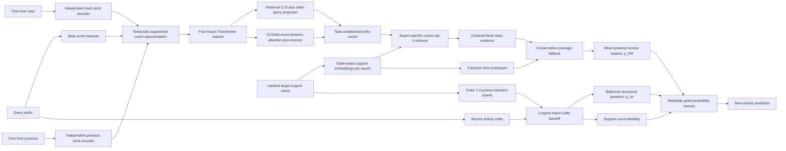
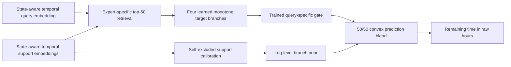

# FM-v3 architecture changes: from FM-v2 to promoted multi-metric FM-v3

This document is the source of truth for the architecture currently selected
for the paper. It explains what changed, why each change was made, which parts
were trained, which parts are inference-only, and which experiments were
rejected. Historical classification results live in
[`fmv3_improvement_report.md`](fmv3_improvement_report.md) and
[`structured_fmv3_report.md`](structured_fmv3_report.md). The historical
shared temporal adapter is recorded in
[`fmv3_time_transform_report.md`](fmv3_time_transform_report.md); its Stage-5,
fully independent successor is documented in
[`fmv3_independent_temporal_report.md`](fmv3_independent_temporal_report.md).
The current state-aware prefix projection, its bottleneck audit, and its full
confirmation are documented in
[`fmv3_prefix_attention_report.md`](fmv3_prefix_attention_report.md). The
promoted epoch-38 loss continuation and its transfer limitation are documented
in [`fmv3_multimetric_loss_report.md`](fmv3_multimetric_loss_report.md).

## Short version

The final system is not the original `06_full_fmv3` model. It has six selected
layers:

1. **Corrected FM-v3 checkpoint:** retain FM-v2's reliable centered local
   decision, use full-pool prototypes only to recover labels absent from the
   local top-k neighborhood, fix temperature and multi-expert retrieval bugs,
   and train primarily on classification with explicit missing-local-label
   episodes.
2. **Structured FM-v3 inference:** combine that neural posterior with a
   class-balanced, target-log transition memory keyed by the last one to three
   activities. The transition branch backs off to shorter contexts and is
   automatically suppressed when its context has little or no support.
3. **Independent learned temporal representation:** give elapsed time from
   case start and time since the previous event separate power/scale banks,
   projection MLPs, and residual gates. Add both residuals to the legacy logged
   coordinates and feed the resulting event representation to both
   classification and regression. The regression head remains a third
   independent component with four learned monotone target transforms, a
   query-specific gate, and a support-only branch prior.
4. **State-aware prefix attention:** keep the historical static prefix vector
   as a frozen anchor, then add a gated residual built from the CLS state, the
   last valid event, and a prefix-conditioned attention pool. Classification
   and regression use separate query offsets, gates, and learned ordinal-
   recency strengths.
5. **Multi-metric remaining-time optimization:** continue the state-aware
   model through epoch 38 with explicit MAE, RMSE, Huber, log-RMSE, relative-
   MAE, and bias terms plus transform-gate supervision. This is the promoted
   checkpoint because it improves the established five-log benchmark; its
   worse mean/RMSE result on `roadtraffic_10000` remains a stated limitation.
6. **Regression-only expert confidence endpoint:** continue only the tiny
   expert-confidence heads through epoch 40, but deploy only the regression
   confidence head. The learned classification-confidence head is disabled
   because it slightly lowers decision metrics; the low-support structured
   classifier remains the classification endpoint.

The six-layer Transformer encoder and its four-expert mixture remain the frozen
representation backbone. The structured transition memory remains
classification-only. The two temporal input encoders are shared by both task
paths and can change classification output; only the target-transform bank is
regression-only. The new prefix adapter is task-conditioned and therefore
gives the two tasks different final prefix vectors.

## Eight-stage comparison

| Dimension | FM-v2 baseline | Original full FM-v3 | Corrected FM-v3 | Structured FM-v3 | Historical temporal FM-v3 | Independent temporal FM-v3 | State-aware temporal FM-v3 | Promoted multi-metric FM-v3 |
|---|---|---|---|---|---|---|---|---|
| Encoder | Four Transformer experts | Same backbone, continued training | Same backbone, continued from FM-v2 epoch 20 | Frozen corrected epoch-23 checkpoint | Frozen encoder plus shared regression-only temporal residual | Frozen encoder plus two independent temporal residuals used by both tasks | Same frozen Transformer plus task-conditioned prefix residual | Same architecture, continued through epoch 38 |
| Prefix projection | Static query plus CLS | Same | Same | Same | Same | Same | Dynamic CLS/last-event query, learned recency, explicit last state, historical residual anchor | Same state-aware projection |
| Local geometry | Neighborhood-centered cosine | Uncentered cosine | Neighborhood-centered cosine restored | Same as corrected FM-v3 | Classification unchanged; regression uses adapted embeddings | Both tasks use independently temporal-adapted embeddings | Same head; task-conditioned prefix vectors | Same, jointly continued |
| Local aggregation | Summed soft-kNN mass | Log-sum-exp with learned count normalization | Log-sum-exp with fixed $\gamma=0$ | Same as corrected FM-v3 | Same classifier; four regression transform branches | Same heads; changed shared event representation | Same heads and structured classifier | Same |
| Candidate labels | Local top-k only | Full support pool | Full support pool, but global evidence used only for locally missing labels | Neural candidates plus structured transition evidence | Same classification rule | Same classification rule, new temporal embeddings | Same classification rule, new state-aware embeddings | Same |
| Global combination | None | Learned/fixed global-local fusion for all classes | Margin-gated coverage fallback | Same fallback inside $p_{FM}$ | Same classification; dual regression combination | Same head-level combinations | Same head-level combinations | Same |
| Class prior | Implicit local frequency | Explicit balanced/natural mode | Balanced | Balanced neural head plus uniform structured class prior | Same classification prior | Same classification prior | Same classification prior | Same |
| Abstention | None | Learned missing-pool abstention | Removed | Removed | Removed | Removed | Removed | Removed |
| Target-log adaptation | Embedding retrieval | Embedding retrieval and prototypes | Corrected retrieval and prototypes | Corrected neural memory plus order-1--3 transition memory | Labeled-support branch calibration for regression | Same, with both tasks retrieving in the new temporal representation | Same, in task-specific prefix spaces | Same |
| Target gradients | None | None | None | None | None at adaptation time | None at adaptation time | None at adaptation time | None at adaptation time |
| Remaining-time target rule | Fixed square-root neighbor regression | Same | Same | Same | Four learned monotone branches, inverted to raw hours | Same independent target bank | Same bank, jointly continued with prefix adapter | Same bank trained with promoted multi-metric loss and gate auxiliary |
| Prefix timing inputs | Fixed `log1p` coordinates | Same | Same | Same | Fixed coordinates plus one shared two-clock regression adapter | Fixed coordinates plus separate start/previous banks active for both tasks | Same two clocks plus ordinal attention recency | Same |
| Status | Authoritative baseline | Rejected combined design | Selected neural base | Selected structured classifier | Superseded temporal input design | Earlier predecessor | Architecture predecessor | **Selected base checkpoint; current endpoint adds regression-only confidence** |

## Architecture at a glance

The regression head after the shared temporal representation is separate:

The two memory systems are complementary:

- The **embedding memory** transfers similarity learned across source logs and
  can generalize between prefixes that are not exact symbolic matches.
- The **transition memory** enforces the explicit target-process state and
  prevents cosine retrieval from overlooking a well-observed outgoing
  transition.

## What stayed unchanged

The following are not new architectural claims:

- Event prefixes are still encoded by the existing event-native Transformer;
  its weights, width, depth, input scaling, and positional encoding are frozen.
- The learned configuration still uses four independently trained experts.
- Activity identifiers remain **log-local**. An identifier has no shared
  semantic meaning across logs.
- Support and query cases remain disjoint, and target-log adaptation remains
  gradient-free for both tasks.
- The selected structured branch operates only on next-activity
  classification.
- The regression target-transform bank operates only on remaining-time
  regression. The two independent temporal input encoders alter the shared
  event representation and therefore feed both classifier and regressor. The
  prefix adapter also feeds both tasks, but owns task-specific query offsets,
  residual gates, and recency strengths.

This distinction matters: none of the improvements increases Transformer depth
or width. Classification now gains from structured support memory, learned
temporal inputs, and the state-aware projection. Remaining-time gains combine
that representation with learned target geometry and support-only branch
adaptation around the frozen backbone.

## Stage 0: FM-v2 baseline

FM-v2 retrieves a local top-k neighborhood for a query embedding. It centers
the query and retrieved embeddings by the neighborhood mean, computes cosine
similarities, and sums softmax attention mass for examples with the same
label. Only labels present in top-k are candidates.

This design is effective when retrieval contains the correct activity, but it
couples three separate concerns:

1. semantic relevance of examples;
2. reachability of an activity label;
3. frequency of that label among retrieved examples.

If a label exists elsewhere in the target support pool but is absent from the
query's top-k neighborhood, its prediction probability is exactly zero.

Reference configuration:
[`configs/fmv3/00_fmv2.yaml`](../configs/fmv3/00_fmv2.yaml).

## Stage 1: the original full FM-v3 and why it was not selected

The initial `06_full_fmv3` design attempted to decouple local evidence, global
coverage, and class prevalence. It introduced:

- realistic balanced, natural, long-tail, random-shot, rare-path, and
  missing-label episodes;
- count-normalized local evidence;
- full-support class prototypes;
- count-dependent prototype shrinkage;
- fixed and learned global-local gates;
- explicit balanced or natural class priors;
- dynamic retrieval expansion;
- an abstention output for support-pool-unseen labels.

Those are useful ablation concepts, but the combined checkpoint was not a
successful final architecture. Its main problems were both conceptual and
implementation-related:

| Problem | Consequence |
|---|---|
| Learned temperature was disconnected from the FM-v3 evidence paths | `learn_temperature: true` did not change those logits |
| FM-v2 neighborhood centering was silently removed | The comparison changed similarity geometry as well as aggregation |
| Expert 0's neighbor indices were reused for every expert | Experts 1-3 were evaluated with neighborhoods from the wrong embedding space |
| Global-local `logaddexp` fusion modified every class score | Noisy global prototypes could overturn strong local decisions even when no coverage repair was needed |
| Shrinkage, gate, count-normalization, and abstention parameters moved little | Added capacity did not become a reliable adaptive mechanism |
| Missing-pool-label training asked an opaque-label model to predict an unavailable class | The task is information-theoretically impossible without external semantics or constraints |
| Training sampled classification and regression equally | Only half the updates optimized the paper's primary next-activity endpoint |

The historical pre-audit results are retained in
[`fmv3_evaluation_report.md`](fmv3_evaluation_report.md), but that report does
not describe the selected final architecture.

## Stage 2: corrected FM-v3

### 2.1 Reconnected learned temperature

The local and global evidence scales now depend on the learned `logit_scale`:

$$
\operatorname{scale}_{local}
= \frac{\operatorname{clip}(s,1,20)/s_0}{T_{local}},
\qquad
\operatorname{scale}_{global}
= \frac{\operatorname{clip}(s,1,20)/s_0}{T_{global}}.
$$

Here $s$ is the learned scale and $s_0$ is its initialization reference. This
makes the configuration flag and its gradient path agree. The implementation
is in [`components/prototypical_head.py`](../components/prototypical_head.py).

### 2.2 Restored centered local geometry

The selected head uses `local_centering: true`. For retrieved support vectors
$z_i$ and query $q$, it subtracts the local support mean and renormalizes before
computing similarities. Count normalization is fixed at $\gamma=0$, so local
class evidence is

$$
L_c(q)=\log\sum_{i\in\mathcal N_k(q):y_i=c}
\exp\bigl(\operatorname{scale}_{local}\,
\operatorname{cos}(q,z_i)\bigr).
$$

At a matched similarity scale, omitting the common softmax normalizer makes this
the same class score and ordering as FM-v2's summed attention mass. Continued
training may adjust the learned scale, but the local geometry and aggregation
form are restored. The corrected experiment therefore changes candidate
coverage without needlessly replacing a strong local rule.

### 2.3 Made retrieval expert-specific

Each expert now retrieves top-k neighbors using its own query and support
embeddings. The four posterior vectors are aligned to the same target-log class
space and averaged only after each expert has evaluated its own neighborhood.

This is an evaluator correction, but it changes effective model behavior: an
ensemble of different embedding spaces is no longer forced to share expert
0's neighborhood. The batched implementation is in
[`evaluation/fmv3_protocol.py`](../evaluation/fmv3_protocol.py).

### 2.4 Replaced global-local fusion with conservative coverage fallback

Global prototypes are still formed from every labeled support prefix:

$$
\mu_c = \operatorname{normalize}\left(
\frac{1}{N_c}\sum_{i:y_i=c} z_i
\right),
\qquad
G_c(q)=\operatorname{scale}_{global}\,q^\top\mu_c.
$$

However, global evidence no longer perturbs classes already represented in the
local neighborhood. For a locally present class, the final evidence is simply
$L_c$. For a support-covered but locally missing class,

$$
E_c = \max_{j\in C_{local}}L_j
      +G_c
      -\max_{j\in C_{local}}G_j
      -m,
$$

where the selected margin is $m=1.0$. Thus a missing class can win only when
its global prototype exceeds the best locally present prototype by more than
the margin. This makes global memory a **candidate-recovery mechanism**, not a
second classifier that rewrites all decisions.

The selected head disables prototype shrinkage and abstention because neither
was reliably learned in the original full model. A class absent from the
entire target support pool remains unavailable; the model does not pretend to
infer an opaque unseen label.

### 2.5 Changed the training distribution

The corrected continuation uses:

- 80% classification and 20% remaining-time steps, rather than 50/50;
- 25% deliberately constructed `missing_local_label` classification episodes;
- no `missing_pool_label` episodes;
- balanced, natural, long-tail, random-shot, and rare-path episodes for the
  remainder;
- a 5x prototypical-head learning-rate multiplier after warmup.

The classification episode mixture is exactly:

| Episode type | Probability within classification steps |
|---|---:|
| Balanced | 0.25 |
| Natural | 0.15 |
| Long-tail | 0.10 |
| Random-shot | 0.15 |
| Rare-path | 0.10 |
| Missing local label | 0.25 |
| Missing pool label | 0.00 |

In a missing-local-label episode, the query's correct label is removed from its
retrieved local neighbors but remains in the global support pool. This directly
trains the failure mode that coverage fallback can actually solve.

The run continues the common FM-v2 epoch-20 checkpoint. Epoch 23 was selected;
epoch 25 was evaluated and rejected after balanced accuracy began to regress.
The configuration chain is:

1. [`11_corrected_fallback_m05.yaml`](../configs/fmv3/11_corrected_fallback_m05.yaml)
2. [`12_corrected_fallback_m10.yaml`](../configs/fmv3/12_corrected_fallback_m10.yaml)
3. [`corrected_fmv3.yaml`](../configs/fmv3/corrected_fmv3.yaml)

### 2.6 Separated decision temperature from fallback calibration

The selected checkpoint uses ordinary inference temperature 1.0. Queries for
which a globally covered label is missing locally use fallback temperature
0.4. This changes probability sharpness only in the regime where the fallback
candidate set is active; it does not change which evidence sources are
available.

## Stage 3: structured transition memory

### 3.1 Bottleneck after correcting the neural head

Corrected FM-v3 still maps the complete prefix to one generic embedding and
retrieves by cosine similarity. The embedding may consider activities,
resources, costs, and time, but retrieval does not guarantee that neighbors
share the query's explicit process state. In particular, it can mix prefixes
with different recent activity suffixes and therefore different outgoing
transitions.

The final improvement adds an exact, log-local transition memory alongside the
embedding memory.

### 3.2 Stored state

For every labeled support prefix ending at activity $a_t$, the memory stores
the next activity $c$ under suffixes of order one through three:

$$
s_n=(a_{t-n+1},\ldots,a_t), \qquad n\in\{1,2,3\}.
$$

Only activity identifiers are used. Resource-conditioned keys did not improve
the diagnostic result, and elapsed-time buckets were harmful, so both were
discarded.

### 3.3 Balanced class-conditional score

Let $N_n(s,c)$ be the number of support prefixes with suffix $s$ followed by
class $c$, $N(c)$ the total support count of class $c$, and $V_n$ the number of
distinct order-$n$ suffixes in the memory. With smoothing $\alpha=0.5$,

$$
\ell_c(s)=
\log\bigl(N_n(s,c)+\alpha\bigr)
-\log\bigl(N(c)+\alpha V_n\bigr),
$$

and

$$
p_{str}(c\mid s)=\operatorname{softmax}_c\ell_c(s).
$$

This estimates suffix likelihood given the next class, $P(s\mid c)$, and then
uses a uniform class prior. It is deliberately different from the natural
transition frequency $P(c\mid s)$: a suffix observed once for a rare class is
stronger evidence than the same observation for a globally frequent class.
That choice aligns the memory with balanced accuracy.

Classes absent from the support pool receive no probability mass. The
evaluation class universe is used only to align probability columns and score
zero recall correctly; it does not make an unseen target label predictable.

### 3.4 Longest-suffix backoff

At prediction time the memory checks the order-3 suffix first, then order 2,
then order 1. It uses the longest suffix observed at least once in support. If
no suffix is observed, its own posterior is uniform over support-covered
classes, but its fusion weight is forced to zero, so the final output is exactly
the neural FM posterior.

### 3.5 Reliability-gated fusion

If the selected suffix occurs $n_s$ times, its effective mixture weight is

$$
\lambda(s)=w\frac{n_s}{n_s+\tau},
\qquad w=0.75,\quad\tau=0.5.
$$

The final posterior is

$$
p(c\mid q,s)=
\bigl(1-\lambda(s)\bigr)p_{FM}(c\mid q)
+\lambda(s)p_{str}(c\mid s).
$$

The gate has an interpretable behavior:

| Context support $n_s$ | Effective structured weight $\lambda(s)$ |
|---:|---:|
| 0 | 0.000 |
| 1 | 0.500 |
| 2 | 0.600 |
| 5 | 0.682 |
| many | approaches 0.750 |

This is a probability mixture, not a logit sum. The selected mode is
`fm_structured_mix`; a product/log-linear alternative was screened but was
weaker.

### 3.6 No additional training

Structured memory is constructed from the same target support cases already
available to the FM head. It introduces:

- no new learned parameters;
- no target-log gradient steps;
- no use of held-out query labels when fitting transition counts; the observed
  query prefix is used only to look up its context at inference;
- no changes to the frozen epoch-23 checkpoint;
- no changes to remaining-time inference.

Its configuration is an evaluation-only overlay with no `extends` clause:
[`structured_memory_eval.yaml`](../configs/fmv3/structured_memory_eval.yaml).
This is intentional: loading it must not overwrite the checkpoint's resolved
encoder or corrected-head configuration.

The protocol does supply a fixed target-log activity universe for probability
alignment and for scoring zero recall consistently across support budgets.
Support-absent labels still receive zero evidence. For deployment, this fixed
universe should come from the declared process schema or observed target-log
vocabulary; it is not learned by the transition counts.

## Stage 4: historical shared temporal input and target geometry

Stage 4 is the fully evaluated predecessor. Its output target bank remains in
the current model, but its shared input adapter and regression-only routing are
superseded by Stage 5.

### 4.1 Why transform the two prefix clocks

The original embedder passed cost, elapsed seconds from the first case event,
and seconds from the previous event through a fixed `log1p` map. Replacing only
the remaining-time target would leave the two most relevant timing covariates
in a different geometry. The selected regression path therefore adds a learned
adapter for both `time_from_start` and `time_from_previous`; cost deliberately
stays on the stable fixed path.

For raw seconds $x_f$, feature $f$ is first converted to hours
$h_f=x_f/3600$. Each of four branches has independently learned positive power
$p_{f,k}$ and characteristic scale $s_{f,k}$:

$$
u_{f,k}=\frac{(1+h_f/s_{f,k})^{p_{f,k}}-1}{p_{f,k}},
\qquad
\tilde u_{f,k}=\frac{u_{f,k}}{1+u_{f,k}}.
$$

The rational bound keeps extreme durations finite without breaking
monotonicity. The eight resulting values (two clocks times four branches) pass
through a small normalized MLP and enter the event embedding as a learned
residual. The residual gate starts near 0.12, so the new path begins as a
conservative correction around the frozen representation.

The selected model retains the original logged clock coordinates underneath
this residual. A stricter ablation zeroed those two old coordinates for
regression, but it was materially weaker. Thus both timing variables do pass
through the new transform; retaining the fixed path is an empirical residual
design choice, not an omission.

### 4.2 Learned target-transform bank

Remaining-time labels are stored as $\sqrt{\text{hours}}$ in the historical
task files for checkpoint compatibility. The new head immediately squares
them back to raw nonnegative hours. For branch $k$ it then learns

$$
z_k(y)=\frac{(1+y/s_k)^{p_k}-1}{p_k},
\qquad
z_k^{-1}(v)=s_k\left[(1+p_kv)^{1/p_k}-1\right].
$$

This is not a fixed log or square-root target. As $p_k$ approaches zero it
approaches a log-like map; other learned powers cover square-root-like through
near-linear regimes. Each branch performs its own soft neighbor regression in
its transformed space and is inverted before aggregation, so every branch
prediction is in raw hours.

During training, one factor $a\sim\operatorname{LogUniform}(0.02,50)$ is shared
by the two prefix clocks and the remaining-time target. Predictions are divided
by $a$ before loss calculation. This exposes the model to several orders of
magnitude while preserving the reported unit.

### 4.3 Query gate plus support-only branch prior

A trained dynamic gate scores the four branch predictions separately for each
query using dimensionless neighborhood statistics, attention concentration,
branch disagreement, transform power/scale, and similarity summaries. A
second prior adapts to the target log using labeled support prefixes only:

1. predict up to 512 support prefixes with self-excluded nearest neighbors;
2. measure each branch's support MAE in raw hours;
3. turn relative support errors into a branch prior with temperature 100;
4. make no use of held-out query labels or query errors.

The selected prediction is the equal convex blend of the trained
query-specific prediction and the support-calibrated branch prediction. The
former protects tail RMSE; the latter reduces typical absolute error. Both
components use only learned transform branches—there is no fixed sqrt anchor
in the new output.

### 4.4 Constrained training and classifier isolation

Training starts from corrected FM-v3 epoch 23 and freezes the character CNN,
Transformer, classification head, and all existing parameters. Only the four
experts' temporal input adapters and target-transform banks are trainable. The
selected four-branch model has 40,776 trainable parameters.

The temporal adapter is called only when `task_type == "regression"`.
Classification calls the unchanged embedder path, and the unit suite verifies
bit-exact equality with and without the adapter present. The full confirmation
also re-evaluates classification to verify that balanced accuracy, ordinary
accuracy, and macro-F1 are unchanged.

### 4.5 MAE and RMSE unit

Both training diagnostics and final `mae_hours`/`rmse_hours` compare
predictions and targets after inversion in raw hours. Neither metric is
computed in sqrt space or log space. The only square operation is the one-time
conversion of legacy stored labels back to hours.

### 4.6 Training losses and label spaces

Training optimizes a different object than the reported evaluation metrics, but
it stays in the same raw-hour unit for learned remaining-time heads.

**Classification (episodic and retrieval).** Cross-entropy on the head logits
with configurable `classification_label_smoothing` (default `0.05`). Episodic
steps pass `ignore_index=-100` for queries whose label is absent from the
support prototype set. Retrieval maps each query onto the episode's prototype
classes first and skips unmapped labels.

**Remaining-time primary loss (`learned_transform_ensemble`).** A weighted
mixture of complementary raw-hour metrics, all computed after unit conversion
and (except log-RMSE) after batch-median scale normalization
\(s=m^{p}s_0^{1-p}\):

\[
\mathcal{L}_{\mathrm{reg}}
=
\frac{
\sum_{k\in\mathcal{K}} w_k\,\ell_k
}{\sum_{k\in\mathcal{K}} w_k},
\quad
s = m^{p}\,s_0^{1-p},
\]

| Term \(\ell_k\) | Knob (default) | Role for joint MAE+RMSE |
|---|---|---|
| Scale-normalized MAE | `regression_mae_weight` (0.5) | Explicit central absolute error |
| Scale-normalized RMSE | `regression_rmse_weight` (0.5) | Explicit tail / L2 pressure |
| Huber on \(e/s\) | `regression_huber_weight` (0.15), `regression_huber_delta` (1.0) | Smooth MAE/RMSE bridge |
| \(\mathrm{RMSE}(\log(1+\hat y)-\log(1+y))\) | `regression_log_rmse_weight` (0.15) | Multi-scale tail pressure |
| Mean \(\|e\|/\max(\|y\|,1)\) | `regression_relative_mae_weight` (0.05) | Relative absolute error |
| \(\lvert\mathrm{mean}(e)\rvert/s\) | `regression_bias_weight` (0.05) | Systematic shift control |
| Pinball / quantile residual | `regression_quantile_weight` (0.0), `regression_quantile_level` (0.5) | Optional asymmetric-error term |

Here \(e=\hat y-y\) is the raw-hour residual, \(m\) is the batch median of
targets (floored at 1 hour), \(p=\) `regression_loss_scale_power` (default
`1.0`), and \(s_0=\) `regression_loss_reference_hours` (default `100`).
Setting \(p=0\) recovers a fixed reference-hour normalizer. The displayed
complementary weights are the promoted defaults. Historical experiment roots
pin them to zero and resolved checkpoint configurations remain authoritative,
so the earlier two-term MAE/RMSE runs are still reproducible. Any weight may be
set to zero to drop that term; at least one primary weight must be positive.
The pure component tensors are available from
`PrototypicalHead.regression_loss_components` for diagnostics and tests.
Predictions must be in hours; labels are either stored `sqrt(hours)` (default,
squared on entry) or already-hours when `labels_in_output_space=True`
(episodic path after `MetaLearner` conversion). The primary reduction runs in
float32 even under AMP. Legacy `sqrt_knn` still uses a single Huber loss in
the stored sqrt unit.

The complementary terms were retrained in a controlled epoch-36-to-38
continuation. They improve five-log MAE and RMSE and are promoted as the
selected repository checkpoint. Both metrics regress on the separate
10,000-case Road Traffic log; that accepted transfer limitation remains part
of the selection record. See
[`fmv3_multimetric_loss_report.md`](fmv3_multimetric_loss_report.md) for the
full paired results, uncertainty intervals, artifact hashes, and decision.

**Optional transform-gate auxiliary.** When
`regression_gate_aux_weight > 0`, a soft cross-entropy teaches the dynamic
aggregation weights to put mass on the branch with lowest detached raw-hour
error. Soft targets use temperature
`regression_gate_target_temperature` scaled by the per-query mean branch error
(floored at `1e-4` hours so sub-hour logs still get peaked targets). Branch
predictions are detached so the aux term cannot move branch outputs merely to
make selection easier; the multi-metric primary loss remains authoritative for
the transform parameters. Both retrieval and episodic strategies attach this
term when diagnostics are available.

**Retrieval auxiliaries (classification/regression embedding space).** Optional
supervised contrastive (`retrieval_contrastive_weight`; same-label different-case
positives for classification, nearest-target positives for regression),
NCA-style same-label mass (`retrieval_knn_aux_weight`), and VICReg-style
variance/covariance regularizers (`retrieval_var_weight` /
`retrieval_cov_weight`). These operate on the projection head and are computed
in float32 with same-case pairs removed from the denominator.

**Scale augmentation consistency.** One log-uniform factor shared by the
temporal input path and the remaining-time bank multiplies clocks and support
targets; predictions are divided by the same factor before the loss, so the
optimized unit remains original hours.

## Stage 5: independent temporal inputs shared by both tasks

The Stage-5 architecture keeps the learned regression target bank from Stage
4 but replaces the input adapter. `time_from_start` and
`time_from_previous` now have completely separate `LearnedScalarTimeEncoder`
instances. They share no powers, scales, projection weights, or residual gate.
The start-clock scale grid begins at one minute and extends to 10,000 hours;
the previous-event grid begins at one second and extends to 1,000 hours.

Each component applies the same monotone bounded family from Section 4.1 to
its own scalar input, passes its branch vector through its own bias-free MLP,
and produces a gated 256-dimensional residual. The two residuals are added to
the base event projection. Because this addition is unconditional whenever
`temporal_input_transforms: true`, the resulting representation is consumed by
both classification and regression. There is no regression-only task gate on
the new input path.

The selected `learned_time_independent_4_cls70` variant retains the two old
`log1p` clock coordinates in the common numerical input and supplements them
with the independent learned residuals. A `replace` ablation removes the fixed
coordinates and obtains the strongest classification result, but its full
regression RMSE is 0.0404 hours worse than fixed sqrt. The selected residual
design is the only new variant that improves both MAE and RMSE over both the
fixed-sqrt baseline and the previous learned temporal model. The cost
coordinate remains unchanged.

The true time until the case ends is never an input. It is the remaining-time
label and depends on future events, so exposing it would create target leakage.
Here “the other end” of the observable prefix timing is represented by time
since the previous event, not by time to the future final event.

Training uses the new `temporal_joint` scope. Only the two input encoders and
the regression output bank are trainable; the frozen backbone and existing
heads remain unchanged. Across four experts, the selected four-branch model
has 70,284 trainable parameters. Classification loss reaches both input
encoders, while regression loss reaches both input encoders and the output
bank. The epoch-34 screen nominated the replacement variant, but confirmation
of all saved variants selected the 70%-classification residual design. It
slightly reduces classification means while improving both full-protocol
raw-hour regression errors over both references. Exact results and the
early-stop boundary are in
[`fmv3_independent_temporal_report.md`](fmv3_independent_temporal_report.md).

## Stage 6: state-aware, task-conditioned prefix attention

Stage 5 still collapsed all Transformer event states with one static learned
query shared by every prefix and both tasks, then projected `[CLS; pooled]` to
the final prefix vector. A Receipt diagnostic showed normalized attention
entropy `0.9690`, full-reversal cosine similarity `0.999971`, and identical
classification/regression vectors. The final projection was therefore a
bottleneck even though the Transformer itself used positional encoding.

Stage 6 preserves the complete historical projection as a frozen residual
anchor. It builds a second query from the CLS state and the last valid event,
adds a task-specific query offset, and reuses the historical MHA weights. A
learned task-specific additive bias softly penalizes earlier ordinal positions;
padding receives negative infinity. The last event, state pool, and historical
pool enter a low-rank residual MLP, whose output is scaled by a separate
classification or regression sigmoid gate and added to the old prefix vector.
The initial gate is `sigmoid(-3)=0.0474`, so migration starts close to the
known-good checkpoint.

The ordinal bias does not replace the numerical time features. Every event's
elapsed time from case start and time since its previous event continue through
the independent Stage-5 learned transforms before the Transformer. Stage 6
only adds a soft statement about relative position inside the observed prefix.
The pretrained `sqrt(d_model)` input scale and positional encoding remain
unchanged because retuning them would alter all six frozen Transformer layers.

The Stage-6 `temporal_prefix_joint` continuation exposes only the new prefix
adapter, both learned input clocks, and the regression target bank. Across four
experts this is 991,900 trainable parameters out of 22,362,904. A checkpoint
audit found 36 new state-pool tensors and changes only in the 40 clock tensors
and 40 target-bank tensors; the other 476 common tensors are exactly unchanged.

The Stage-6 full paired confirmation selected
`prefix_state_attention_joint/model_epoch_36.pth`. Relative to Stage 5 it
improves balanced accuracy by `0.001504`, accuracy by `0.001194`, macro-F1 by
`0.001155`, MAE by `0.9078` hours, and RMSE by `0.6301` hours. Architecture
equations, ablations, Receipt support-budget accuracy, attention diagnostics,
and reproduction commands are in
[`fmv3_prefix_attention_report.md`](fmv3_prefix_attention_report.md).

## Stage 7: promoted multi-metric continuation

Stage 7 keeps the complete Stage-6 architecture and continues only the same
116 adapter tensors for epochs 37 and 38. It adds a 0.05 transform-gate
auxiliary and replaces the two-term primary regression objective with the
promoted mixture listed in Section 4.6. The Transformer, character embedder,
base event projection, fallback classifier, and structured inference rule stay
unchanged.

The selected artifact is
`loss_multimetric_gate_aux_005/model_epoch_38.pth`. Against the Stage-6
epoch-36 checkpoint on 400 paired five-log rows, it changes balanced accuracy
by `+0.000268`, accuracy by `-0.000131`, macro-F1 by `+0.000294`, MAE by
`-2.8824` hours, RMSE by `-1.0620` hours, and median absolute error by
`-2.4679` hours. The five-log cluster-bootstrap intervals exclude zero for
both MAE and RMSE improvements.

Promotion is scoped to the established repository benchmark. On the separate
10,000-case Road Traffic log, classification is exactly unchanged and median
absolute error improves by `7.8184` hours, but MAE worsens by `3.9787` hours
and RMSE by `7.7584` hours. This transfer regression is retained as a known
limitation, not averaged away. Full controls, intervals, hashes, and commands
are in [`fmv3_multimetric_loss_report.md`](fmv3_multimetric_loss_report.md).

## Final classification inference algorithm

For each target log and support budget:

1. Split support and query by case; a case cannot occur in both sets.
2. Encode both prefix clocks with their independent learned components, add
   both residuals to every event, and run each materialized support/query
   prefix independently through all four frozen Transformer experts. Combine
   the historical projection with the classification-specific last-state and
   recency-aware prefix residual.
3. For each expert, retrieve its own $k=20$ cosine-nearest support prefixes.
4. Compute centered local evidence and full-pool global prototypes.
5. Apply coverage fallback only to labels missing from that expert's local
   neighborhood.
6. Average the aligned four-expert probabilities to obtain $p_{FM}$.
7. Build order-1--3 transition counts from all labeled support prefixes.
8. Select the longest observed suffix for the query and compute the balanced
   structured posterior $p_{str}$.
9. Compute the support-count gate $\lambda(s)$ and mix the two posterior
   vectors.
10. Predict the activity with maximum final probability and retain the final
    maximum as confidence.

Across the full confirmation protocol, structured contexts covered 93.3% of
queries, the mean selected suffix order was 2.55, and the mean effective
structured weight was 0.606.

## Final remaining-time inference algorithm

For the same case-disjoint target support/query split:

1. Encode support and query prefixes with the same two independent temporal
   input components used by classification, followed by each frozen expert and
   the regression-specific last-state and recency-aware prefix residual.
2. Retrieve the 50 nearest support prefixes independently in each expert's
   embedding space.
3. Run all four learned target transforms, their neighbor-attention scales,
   and inverse maps to obtain branch predictions in hours.
4. Produce the trained query-specific convex prediction in each expert and
   aggregate across experts. The selected base checkpoint uses a uniform
   expert average; the current endpoint uses the epoch-40 regression-confidence
   logits as learned expert weights with softmax temperature 0.1.
5. On labeled support prefixes only, repeat retrieval with the predicted
   prefix itself excluded and estimate the target-log branch prior.
6. Aggregate each branch across experts with the same expert weights, apply
   the support prior, and form the calibrated prediction.
7. Average the query-gated and support-calibrated predictions 50/50 and report
   raw hours.

## Training-time versus inference-time changes

| Change | Training | Inference | Selected final system? |
|---|:---:|:---:|:---:|
| Learned temperature connected to evidence scales | Yes | Yes | Yes |
| Restored local neighborhood centering | Yes | Yes | Yes |
| Expert-specific neighbor retrieval | No | Yes | Yes |
| Conservative coverage fallback | Yes | Yes | Yes |
| 80% classification task sampling | Yes | No | Yes |
| Missing-local-label episodes | Yes | No | Yes |
| Missing-pool abstention objective | Yes | Yes | **Removed** |
| Learned shrinkage and dynamic global-local gate | Yes | Yes | **Removed** |
| Order-1--3 structured transition memory | No | Yes | Yes |
| Reliability-gated posterior mixture | No | Yes | Yes |
| Four learned target transforms | Yes | Yes | Yes |
| Historical shared regression-only clock residual | Yes | Yes | **Superseded** |
| Independent start-clock and previous-event residuals | Yes | Yes, both tasks | Yes |
| Retention of legacy logged clocks beside independent residuals | Yes | Yes, both tasks | Yes |
| Replacement of legacy logged clock coordinates | Yes | Yes, both tasks | **Ablation** |
| Dynamic CLS/last-event prefix query | Yes | Yes, both tasks | Yes |
| Task-specific prefix query offsets and residual gates | Yes | Yes | Yes |
| Learned ordinal-recency attention bias | Yes | Yes | Yes |
| Historical static prefix vector as residual anchor | No | Yes | Yes |
| Shared temporal scale augmentation | Yes | No | Yes |
| Multi-metric MAE/RMSE/Huber/log/relative/bias objective | Yes | No | Yes |
| Transform-gate auxiliary supervision | Yes | No | Yes |
| Query-specific regression gate | Yes | Yes | Yes |
| Support-only regression branch prior | No | Yes | Yes |
| 50/50 regression prediction blend | No | Yes | Yes |

## What each result measures

| Variant | Balanced accuracy | Accuracy | Macro-F1 | Interpretation |
|---|---:|---:|---:|---|
| Corrected FM-v2 evaluator | 0.4136 | 0.6762 | 0.3936 | Re-evaluated neural baseline |
| Corrected FM-v3 | 0.4194 | 0.6837 | 0.3986 | Training, head, and evaluator corrections |
| Structured FM-v3 | 0.4463 | 0.7086 | 0.4177 | Corrected checkpoint plus structured inference memory |
| Independent temporal FM-v3 | 0.4460 | 0.7082 | 0.4177 | Both learned clocks feed the classifier; small tradeoff for the selected regression checkpoint |
| State-aware temporal FM-v3, epoch 36 | 0.4475 | **0.7094** | 0.4189 | Dynamic task-conditioned prefix projection plus joint continuation |
| **Promoted multi-metric FM-v3, epoch 38** | **0.4477** | 0.7092 | **0.4192** | Same architecture continued with the promoted loss mixture |

The corrected checkpoint contributes +0.0059 balanced accuracy over FM-v2.
Structured memory then contributes +0.0269 over corrected FM-v3, for a total
+0.0327 row-averaged improvement. After first averaging within each independent
log, the end-to-end gain is +0.0329 with a 95% log-level bootstrap interval of
[+0.0229, +0.0418]. Every evaluated log improves.

In the earlier corrected-to-structured comparison, NLL and multiclass Brier
score improve, but ECE and AURC worsen. That stage therefore supports a
predictive-performance claim, not a stronger calibration or selective-risk
claim. Calibration should be fitted separately using only a dedicated
validation set.

The current regression design is evaluated on the same 200 paired
support/query rows used by the strongest fixed-sqrt baseline:

| Remaining-time model | MAE (hours) | RMSE (hours) |
|---|---:|---:|
| Fixed sqrt baseline | 1,125.8421 | 1,665.6983 |
| Historical shared temporal adapter | 1,113.7193 | 1,661.9432 |
| Independent temporal FM-v3 | 1,113.1992 | 1,661.3121 |
| State-aware temporal FM-v3, epoch 36 | 1,112.2914 | 1,660.6820 |
| **Promoted multi-metric FM-v3, epoch 38** | **1,109.4089** | **1,659.6200** |
| Current endpoint: low-support structured + regression confidence, T=0.1 | **1,107.6139** | **1,658.1174** |
| Current endpoint minus fixed sqrt | **-18.2282** | **-7.5809** |
| Current endpoint minus state-aware epoch 36 | **-4.6775** | **-2.5646** |

Per-log and per-budget results, including the separate Road Traffic transfer
check, are reported in
[`fmv3_multimetric_loss_report.md`](fmv3_multimetric_loss_report.md), with the
Stage-6 architecture details retained in
[`fmv3_prefix_attention_report.md`](fmv3_prefix_attention_report.md).

## Rejected or non-final alternatives

The following remain useful ablations but are not part of the selected method:

- the original full dynamic global-local gate;
- learned global-prototype shrinkage;
- missing-pool abstention training;
- global centering for the fallback prototypes;
- epoch 25 of the corrected continuation;
- structured-only prediction without the FM reliability fallback;
- product/log-linear FM-structured fusion;
- resource-conditioned structured keys;
- elapsed-time-bucket structured keys;
- extending the stronger low-support structured suffix rule beyond eight
  support prefixes, which lowers overall classification metrics on the current
  endpoint;
- a structured remaining-time median branch, which gave only a small aggregate
  screen improvement and regressed Billing;
- the historical shared two-clock, regression-only input adapter, now retained
  only for checkpoint compatibility;
- eight input/target branches, which did not improve the full confirmation;
- replacing the legacy logged clock coordinates, which gave the strongest
  classification result but missed the fixed-sqrt RMSE by 0.0404 hours;
- 50% rather than 70% classification episode sampling for the four-branch
  residual design, which was slightly weaker on full MAE and RMSE;
- the query gate alone, which protected RMSE but regressed MAE;
- the support branch prior alone, which improved MAE but slightly regressed
  full-protocol RMSE;
- direct raw-hour soft-kNN prediction without the learned remaining-time
  transform bank, which worsened MAE, RMSE, median AE, normalized MAE, and R²
  on the current endpoint confirmation;
- a state-aware path with near-zero recency, which confirmed that the explicit
  last state drives much of the classification gain but was weaker overall;
- prefix-only continuation without joint clock/target-bank updates;
- 80% classification sampling and a stronger initial recency of 0.5;
- epoch 38 of the original prefix variants without the promoted loss mixture,
  which did not improve the development screen over epochs 35--36.

Documenting these exclusions prevents an ablation or discarded screen from
being mistaken for the final architecture.

## Code and configuration map

| Concern | Source |
|---|---|
| Neural local/global/fallback head | [`components/prototypical_head.py`](../components/prototypical_head.py) |
| Classification/regression task sampling | [`training.py`](../training.py) |
| Retrieval episode construction and missing-label logic | [`training_strategies/retrieval_strategy.py`](../training_strategies/retrieval_strategy.py) |
| Case-disjoint protocol, per-expert retrieval, structured memory, and fusion | [`evaluation/fmv3_protocol.py`](../evaluation/fmv3_protocol.py) |
| Corrected checkpoint configuration | [`configs/fmv3/corrected_fmv3.yaml`](../configs/fmv3/corrected_fmv3.yaml) |
| Structured inference overlay | [`configs/fmv3/structured_memory_eval.yaml`](../configs/fmv3/structured_memory_eval.yaml) |
| Independent start/previous temporal input encoders and legacy adapter | [`components/temporal_adapter.py`](../components/temporal_adapter.py) |
| Learned target-transform bank and query gate | [`components/prototypical_head.py`](../components/prototypical_head.py) |
| Four-branch temporal training configuration | [`configs/fmv3/learned_time_4_temporal.yaml`](../configs/fmv3/learned_time_4_temporal.yaml) |
| Temporal confirmation overlay | [`configs/fmv3/time_transform_confirmation_eval.yaml`](../configs/fmv3/time_transform_confirmation_eval.yaml) |
| Selected independent temporal training configuration | [`configs/fmv3/learned_time_independent_4_cls70.yaml`](../configs/fmv3/learned_time_independent_4_cls70.yaml) |
| Independent temporal screen overlay | [`configs/fmv3/independent_temporal_screen_eval.yaml`](../configs/fmv3/independent_temporal_screen_eval.yaml) |
| Independent temporal confirmation overlay | [`configs/fmv3/independent_temporal_confirmation_eval.yaml`](../configs/fmv3/independent_temporal_confirmation_eval.yaml) |
| Historical and state-aware prefix projections | [`components/event_encoder.py`](../components/event_encoder.py) |
| Stage-6 state-aware joint training configuration | [`configs/fmv3/prefix_state_attention_joint.yaml`](../configs/fmv3/prefix_state_attention_joint.yaml) |
| **Canonical selected configuration** | [`configs/fmv3/selected.yaml`](../configs/fmv3/selected.yaml) |
| Promoted experiment configuration | [`configs/fmv3/loss_multimetric_gate_aux_005.yaml`](../configs/fmv3/loss_multimetric_gate_aux_005.yaml) |
| Current regression-confidence endpoint overlay | [`configs/fmv3/regression_confidence_low_support_confirmation_eval.yaml`](../configs/fmv3/regression_confidence_low_support_confirmation_eval.yaml) |
| Rejected raw-prediction regression ablation overlay | [`configs/fmv3/raw_prediction_regression_confidence_confirmation_eval.yaml`](../configs/fmv3/raw_prediction_regression_confidence_confirmation_eval.yaml) |
| State-aware development overlay | [`configs/fmv3/prefix_attention_screen_eval.yaml`](../configs/fmv3/prefix_attention_screen_eval.yaml) |
| State-aware confirmation overlay | [`configs/fmv3/prefix_attention_confirmation_eval.yaml`](../configs/fmv3/prefix_attention_confirmation_eval.yaml) |
| Prefix compatibility, masking, task-gradient, and scope tests | [`tests/test_event_encoder.py`](../tests/test_event_encoder.py) |
| Unit tests for fallback and structured memory | [`tests/test_fmv3_protocol.py`](../tests/test_fmv3_protocol.py) |
| Unit tests for transform inversion, gradients, independent scopes, and both-task routing | [`tests/test_fmv3_head.py`](../tests/test_fmv3_head.py) |
| Full structured result generator | [`generate_structured_fmv3_report.py`](../generate_structured_fmv3_report.py) |

## Reproduction and validity boundary

The exact commands are in the repository
[`README.md`](../README.md#fm-v3-experiments). The primary protocol uses five
unseen event logs, five nested natural-support repetitions, absolute case
budgets 1--128 plus eligible full-support rows and fixed case-disjoint queries.
Classification uses balanced-prior structured inference at $k=20$; the
selected remaining-time head uses $k=50$.

Temporal, prefix-architecture, and loss screening used the same five logs
before promotion. The later 10,000-case Road Traffic check regresses in mean
MAE and RMSE and is reported separately. Although all evaluation comparisons
use fixed, case-disjoint paired rows, a publication claim beyond this
repository benchmark still requires additional untouched logs or a nested
log-level development/test split with a predeclared stopping rule.
