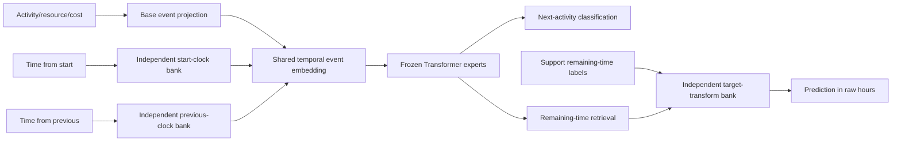

# FM-v3 independent temporal architecture

## Status and selected checkpoint

This is the current temporal architecture. It supersedes the shared,
regression-only input adapter documented in
[`fmv3_time_transform_report.md`](fmv3_time_transform_report.md).

The selected closing checkpoint is
`checkpoints/fmv3/learned_time_independent_4_cls70/model_epoch_34.pth`.
Training completed epoch 34 and was stopped during epoch 35 at the user's
request to close the experiment. Epoch 35 is not a checkpoint and is not used
or reported. The configuration permits training through epoch 45 so that the
same run can be continued later; it must not be described as a completed
45-epoch result.

## What changed

The previous design learned one adapter over two timing columns, used a shared
projection for both clocks, and invoked it only for regression. The new design
has three parameter-disjoint learned temporal components:

1. `start_time_encoder` transforms elapsed time since the first case event;
2. `previous_time_encoder` transforms time since the preceding event;
3. `time_transform_bank` transforms the remaining-time target inside the
   regression head.

The first two components are now part of the event embedding for **both**
classification and regression. Classification gradients therefore train both
observable-clock encoders. Only the third component is regression-specific.
The selected variant keeps the old `log1p(time_from_start)` and
`log1p(time_from_previous)` coordinates in the common numerical projection and
adds the two learned residuals. A replacement ablation zeroes the old
coordinates so the learned encoders are the only clock path; it improves
classification more strongly but is weaker on the full regression protocol.
The cost coordinate is unchanged in every variant.

### Observable clocks and target leakage

The available prefix fields are:

- `time_from_start`: seconds elapsed since the first observed event;
- `time_from_previous`: seconds elapsed since the preceding observed event.

There is no legitimate observable “time from the end” at inference time. The
actual time from the prefix to the final case event is the remaining-time
label. Feeding it into the encoder would reveal the regression answer and leak
future information into classification. In this implementation, the requested
second clock is therefore interpreted as the existing, observable
`time_from_previous` feature. The remaining-time label is used only by the
regression loss and support-label calculations.

## Independent input encoders

For clock $f$ and raw seconds $x_f$, define nonnegative hours
$h_f=\max(x_f,0)/3600$. Each clock owns its own number of branches, powers,
scales, projection MLP, and residual gate. For branch $k$:

$$
u_{f,k}=\frac{\exp\!\left(p_{f,k}\log(1+h_f/s_{f,k})\right)-1}{p_{f,k}},
\qquad
\tilde u_{f,k}=\frac{u_{f,k}}{1+u_{f,k}}.
$$

Both $p_{f,k}$ and $s_{f,k}$ are positive learned values. The rational bound
keeps long durations finite while preserving monotonicity. Each clock's
bounded branch vector passes through its own bias-free MLP and its own sigmoid
residual gate. Bias-free projection makes a zero-duration input produce an
exact zero residual, which is useful for first events and padding. The two
residuals are added to the normal event embedding:

$$
e'_t=e_t+g_{start}P_{start}(\tilde u_{start})
          +g_{previous}P_{previous}(\tilde u_{previous}).
$$

The selected model uses four branches for each clock, but their ranges differ
to reflect their different physical scales:

| Component | Initial scale range | Power range | Branches |
|---|---:|---:|---:|
| Time from start | 1 minute to 10,000 hours | 0.05 to 1.50 | 4 |
| Time from previous event | 1 second to 1,000 hours | 0.05 to 1.50 | 4 |

The branch counts are configurable independently. Tests instantiate unequal
3- and 5-branch encoders and verify that changing the start-clock parameters
cannot change the previous-clock transformed features.

### Task flow



There is no task-type gate around the two input encoders. During regression
training, one scale augmentation factor is shared by the start clock, previous
clock, and remaining-time target. During classification, no regression scale
augmentation is applied, but both learned clock encoders remain active.

## Regression target bank and metric units

The regression head retains the previously validated four-branch learned
target geometry. For raw remaining time $y$ in hours, branch $k$ learns

$$
z_k(y)=\frac{(1+y/s_k)^{p_k}-1}{p_k},
\qquad
z_k^{-1}(v)=s_k\left[(1+p_kv)^{1/p_k}-1\right].
$$

This family can become log-like, square-root-like, or near-linear; it is not
fixed to either a logarithm or square root. Historical labels are stored as
`sqrt(hours)` for compatibility and are squared once on entry. Every learned
branch is inverted to hours before aggregation. `mae_hours` and `rmse_hours`
therefore compare predictions and targets in raw hours.

## Training and checkpoint migration

`trainable_scope: temporal_joint` freezes the character CNN, base numerical
projection, Transformer, classification head, and all other existing weights.
Across four experts, the selected four-branch model trains 70,284 parameters:

| Learned scope | Parameters |
|---|---:|
| Four start-clock encoders | 33,316 |
| Four previous-clock encoders | 33,316 |
| Four regression target banks | 3,652 |
| Total | 70,284 |

The run starts from the previously selected epoch-33 temporal checkpoint. The
compatible loader preserves the learned regression target bank, initializes
40 new independent-clock tensors from the new configuration, and explicitly
ignores 44 tensors from the superseded shared adapter. This is an intentional
architecture migration, not a permissive load of arbitrary mismatches.

## Development screen and selection

The closing screen used both tasks, five nested case budgets (1, 4, 16, 64,
128), two repetitions, natural support, retrieval $k=20$, at most 50 query
cases and 500 query prefixes per log. It produced 48 classification and 48
regression rows per variant. The previous selected temporal checkpoint was
re-evaluated under the identical screen.

| Variant at epoch 34 | Balanced accuracy | Accuracy | Macro-F1 | MAE (h) | RMSE (h) |
|---|---:|---:|---:|---:|---:|
| Previous shared regression-only adapter | 0.444966 | 0.710279 | 0.414658 | 1,047.1453 | 1,622.2654 |
| 4 branches, retain legacy clock coordinates | 0.445046 | 0.709838 | 0.414764 | 1,046.1902 | 1,620.9578 |
| 8 branches, retain legacy clock coordinates | 0.445007 | 0.709549 | 0.414864 | 1,046.5385 | 1,621.6806 |
| 4 branches, 70% classification episodes | 0.444433 | 0.709888 | 0.414508 | **1,045.3381** | 1,620.1293 |
| **4 branches, replace legacy clock coordinates** | **0.453343** | **0.714826** | **0.422081** | 1,047.0464 | **1,617.3315** |

Relative to the previous selected model, the screen-leading `replace` variant changes
the screen means by +0.008377 balanced accuracy, +0.004547 accuracy, +0.007423
macro-F1, -0.0989 hours MAE, and -4.9339 hours RMSE. Lower MAE/RMSE is better.
It was the screen candidate because it had the strongest joint classification
improvement while still improving both regression errors. The larger full
confirmation was then run for all four new variants and changed the final
selection.

These are architecture-selection results, not a substitute for the larger
five-repetition confirmation.

## Full confirmation and final selection

The full protocol contains 200 paired rows for each task: five logs, five
repetitions, natural nested support budgets from 1 to 128 plus eligible full
pools, case-disjoint queries capped at 1,000 prefixes per log, classification
$k=20$, and regression $k=50$.

| Full-confirmation model | Balanced accuracy | Accuracy | Macro-F1 | MAE (h) | RMSE (h) |
|---|---:|---:|---:|---:|---:|
| Fixed-sqrt baseline | 0.446293 | 0.708601 | 0.417745 | 1,125.8421 | 1,665.6983 |
| Previous learned temporal model | 0.446293 | 0.708601 | 0.417745 | 1,113.7193 | 1,661.9432 |
| 4 branches, retain legacy coordinates | 0.445972 | 0.708062 | 0.417489 | 1,113.9028 | 1,661.9488 |
| **4 branches, 70% classification episodes** | 0.445968 | 0.708158 | **0.417730** | **1,113.1992** | **1,661.3121** |
| 8 branches, retain legacy coordinates | 0.445861 | 0.707783 | 0.417469 | 1,114.3550 | 1,662.1043 |
| 4 branches, replace legacy coordinates | **0.451008** | **0.710052** | **0.420429** | 1,119.2349 | 1,665.7387 |

The selected 70%-classification checkpoint is the only new variant that
improves both full-protocol regression metrics over both references. Relative
to fixed sqrt it changes MAE by -12.6429 hours and RMSE by -4.3861 hours.
Relative to the previous learned model it changes MAE by -0.5201 hours and RMSE
by -0.6310 hours.

The result has a small classification cost relative to the unchanged previous
classifier: -0.000325 balanced accuracy, -0.000443 ordinary accuracy, and
-0.000015 macro-F1. The replacement variant instead improves classification
by +0.004714 balanced accuracy, +0.001451 accuracy, and +0.002684 macro-F1, but
misses the fixed-sqrt RMSE by 0.0404 hours and is materially weaker than the
previous learned regression model. The final selection follows the earlier
requirement to beat the regression baseline on both MAE and RMSE; both Pareto
points remain reported.

Selected full results:
`evaluation_results/independent_temporal/confirmation_learned_time_independent_4_cls70_e34/results.csv`.

## Verification

The unit suite covers the architectural contract directly:

- the two input banks have disjoint parameter storage and independent branch
  counts;
- classification output changes when the new temporal features are enabled;
- classification backpropagation reaches both input banks;
- start-clock, previous-clock, and output-target banks are pairwise disjoint;
- `temporal_joint` exposes only those three temporal scopes to optimization;
- legacy checkpoint behavior remains available through the old adapter;
- learned target transforms remain numerically invertible.

At closure, `python -m unittest discover -s tests -v` passes 28 tests. YAML
configuration loading, Python compilation, and `git diff --check` also pass.

A direct epoch-33/epoch-34 state audit finds 40 newly added independent-input
tensors and 40 changed common tensors, all belonging to the regression output
banks. The 44 old shared-adapter tensors are absent by design. No common tensor
outside `temporal_input_encoder` or `time_transform_bank` changes, and no
unexpected new tensor is present. This confirms the configured frozen scope at
checkpoint level, not only through `requires_grad` flags.

The learned checkpoint is also visibly feature-specific: start-clock and
previous-event power/scale tensors differ within every expert, and their eight
residual gates span approximately 0.0456--0.0486 after one completed epoch.
They are not aliases or copies of one shared learned component.

## Reproduction

Selected training configuration:
[`configs/fmv3/learned_time_independent_4_cls70.yaml`](../configs/fmv3/learned_time_independent_4_cls70.yaml)

Two-task screen configuration:
[`configs/fmv3/independent_temporal_screen_eval.yaml`](../configs/fmv3/independent_temporal_screen_eval.yaml)

Full confirmation configuration:
[`configs/fmv3/independent_temporal_confirmation_eval.yaml`](../configs/fmv3/independent_temporal_confirmation_eval.yaml)

To reproduce the one completed continuation epoch, seed a new checkpoint
directory with the epoch-33 model and its loader artifacts, then run:

```bash
python main.py \
  --config configs/fmv3/learned_time_independent_4_cls70.yaml \
  --checkpoint_dir checkpoints/fmv3/learned_time_independent_4_cls70 \
  --resume \
  --stop_after_epoch 34
```

Evaluate the selected checkpoint with:

```bash
python evaluate_fmv3.py \
  --checkpoint_dir checkpoints/fmv3/learned_time_independent_4_cls70 \
  --checkpoint_epoch 34 \
  --eval_config configs/fmv3/independent_temporal_confirmation_eval.yaml \
  --output_dir evaluation_results/independent_temporal/confirmation_learned_time_independent_4_cls70_e34
```

## Validity boundary

The five evaluation logs were used to compare architectural variants, so the
screen establishes a repository benchmark result rather than an untouched
external-test claim. The selected checkpoint also received only one completed
continuation epoch. Stronger publication claims require untouched logs or a
nested log-level development/test split and a predeclared stopping rule.
