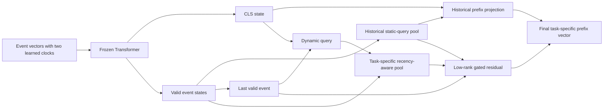

# FM-v3 state-aware prefix attention

## Status and selected checkpoint

This is the current learned FM-v3 architecture. It succeeds the independent
temporal model documented in
[`fmv3_independent_temporal_report.md`](fmv3_independent_temporal_report.md)
and keeps that model's two independent observable-clock encoders and learned
remaining-time target bank.

The selected checkpoint is
`checkpoints/fmv3/prefix_state_attention_joint/model_epoch_36.pth`. It was
initialized from `learned_time_independent_4_cls70` epoch 34 and trained for
two continuation epochs. The selected full paired result is
`evaluation_results/prefix_attention/confirmations/prefix_state_attention_joint_e36/results.csv`.

### Decision and result at a glance

**Decision: accept the change and make epoch 36 the selected architecture.**
It improves every aggregate primary metric over the immediate predecessor on
the same paired evaluation rows. “Improves” here means higher classification
scores and lower raw-hour regression errors:

| Metric | Independent temporal, epoch 34 | State-aware joint, epoch 36 | Change | Direction |
|---|---:|---:|---:|---|
| Balanced accuracy | 0.445968 | **0.447473** | **+0.001504** | Higher is better |
| Accuracy | 0.708158 | **0.709352** | **+0.001194** | Higher is better |
| Macro-F1 | 0.417730 | **0.418885** | **+0.001155** | Higher is better |
| MAE | 1,113.1992 h | **1,112.2914 h** | **-0.9078 h** | Lower is better |
| RMSE | 1,661.3121 h | **1,660.6820 h** | **-0.6301 h** | Lower is better |

This is an aggregate repository-benchmark improvement, not a claim that every
individual log or support budget improves. The per-log exceptions and the
selection-validity boundary are documented below.

The main change is the projection from Transformer event states to the prefix
vector. The historical static attention query remains as a frozen residual
anchor. A small trainable path adds an explicit last-event state, a
prefix-conditioned attention query, task-specific controls, and a learned
ordinal-recency prior. Joint continuation also updates the already selected
start/previous-event temporal encoders and regression target bank. The
Transformer, character CNN, base event projection, historical pooling path,
and retrieval/classification heads stay frozen.

The data flow changes as follows:



The historical path `Z0` is unchanged. The new path only contributes the
small gated residual `R`.

## Bottleneck found in the historical projection

For an encoded prefix with Transformer outputs
`[h_cls, h_1, ..., h_L]`, the old projection used one learned query `q_0` for
every prefix and both tasks:

\[
p_0=\operatorname{MHA}(q_0,H,H), \qquad
z_0=\operatorname{LayerNorm}(W_0[h_{cls};p_0]).
\]

This creates three connected bottlenecks:

- the pooling query cannot adapt to the current prefix;
- the last observed event is not an explicit input to the projection;
- classification and regression receive exactly the same prefix vector.

Diagnostics on 512 Receipt prefixes from the epoch-34 predecessor found a
normalized pooling-attention entropy of `0.9690`, so the static pool was close
to diffuse averaging. On 256 prefixes of length at least four, mean cosine
similarity between the original vector and a fully reversed prefix was
`0.999971`; moving the last event to the front still produced `0.999985`.
Classification and regression prefix vectors were bit-identical. These are
diagnostics of the representation, not predictive metrics, but together they
showed that the final projection was behaving nearly like a task-agnostic bag
of event states.

The input sequence is multiplied by `sqrt(d_model)` before positional encoding,
which is `16` for `d_model=256`. Changing that scale or the positional encoding
would alter the input distribution of all six frozen Transformer layers. The
new architecture therefore leaves this pretrained path intact and adds an
explicit state-sensitive residual after it.

## New prefix projection

Let `h_L` be the last non-padding Transformer event state and let `t` denote
classification or regression. The new query is

\[
q_t=\operatorname{LayerNorm}
\left(g_\phi([h_{cls};h_L])+e_t\right),
\]

where `g_phi` is a bias-free `512 -> 128 -> 256` MLP and `e_t` is a separate
learned task-query offset. The adapter reuses the frozen historical
multi-head-attention projection matrices; it does not introduce a second set
of full `Q/K/V` weights.

For event position `j`, define normalized ordinal age

\[
a_j=\frac{L-1-j}{\max(L-1,1)}.
\]

The additive attention bias is

\[
b_{t,j}=-\operatorname{softplus}(\rho_t)a_j,
\]

with padding positions fixed to negative infinity. This is a soft, learned
recency prior: the newest event has zero penalty, earlier events receive a
monotonically larger penalty, and content attention can still select any valid
event. Classification and regression own separate `rho_t` values.

The state pool and gated residual are

\[
s_t=\operatorname{MHA}(q_t,H,H;b_t),
\]

\[
r_t=\operatorname{LayerNorm}
\left(W_2\operatorname{GELU}(W_1[h_L;s_t;p_0])\right),
\]

\[
z_t=z_0+\sigma(\gamma_t)r_t.
\]

The separate task gates `gamma_t` start at `sigmoid(-3)=0.0474`, keeping the
new checkpoint close to the known-good historical vector at migration. The
old vector `z_0` is never removed or renormalized, so disabling
`state_aware_prefix_attention` exactly reproduces historical checkpoint
behavior.

Padding is handled in both places that depend on sequence length: `h_L` is
gathered from the last valid index, and the attention bias assigns negative
infinity to every padded key. Unit tests verify that arbitrary changes to
padding values cannot change the prefix vector.

## Relationship to the two observable clocks

There are now two distinct notions of time in the input path:

1. Every event's `time_from_start` and `time_from_previous` values still pass
   through their parameter-disjoint learned monotone encoders before the
   Transformer. Their residuals feed both tasks. The legacy `log1p` coordinates
   remain in parallel.
2. Prefix attention adds an ordinal-recency prior over event positions. It
   expresses which event is recent in the prefix, not how many seconds elapsed,
   and therefore complements rather than replaces the two numerical clocks.

The true time until case completion is never an input because it is the
remaining-time target. The regression output bank still inverts all four
learned target branches to raw hours before aggregation. MAE and RMSE are
therefore computed in hours, not in square-root or log space.

## Parameter and checkpoint scope

Across four experts, `temporal_prefix_joint` exposes 116 tensors and 991,900
parameters out of 22,362,904 total parameters. The trainable set contains only:

- the new state-aware prefix projection;
- the independent start and previous-event input encoders;
- the regression target-transform bank.

A tensor-level comparison between the epoch-34 seed and selected epoch-36
checkpoint found 36 new state-pool tensors, 40 changed temporal-input tensors,
and 40 changed target-bank tensors. All other 476 common tensors were exactly
equal; there were zero out-of-scope changes.

Checkpoint migration accepts missing `encoder.state_aware_pool.*` tensors and
initializes them from the resolved YAML configuration. Historical
configurations keep the feature disabled by default. The two constrained
training scopes are:

- `prefix_attention`: train only the new projection;
- `temporal_prefix_joint`: train the projection, both observable-clock
  encoders, and the target bank.

### Configuration reference

| Key | Selected value | Meaning |
|---|---:|---|
| `state_aware_prefix_attention` | `true` | Enables the new residual path |
| `prefix_attention_hidden_dim` | `128` | Width of the query and residual bottlenecks |
| `prefix_attention_dropout` | `0.15` | Dropout inside the residual projector |
| `prefix_attention_gate_logit` | `-3.0` | Conservative initial residual gate (`0.0474`) |
| `prefix_attention_initial_recency` | `0.25` | Initial positive ordinal-recency strength |
| `trainable_scope` | `temporal_prefix_joint` | Restricts training to prefix/clock/target adapters |
| `classification_task_probability` | `0.70` | Classification share of continuation episodes |

Historical YAML configurations resolve the enable flag to `false`, retaining
the old prefix projection exactly.

## Development variants

All variants were seeded from the same epoch-34 independent-temporal
checkpoint. Training used 200 retrieval episodes per epoch, learning rate
`0.001`, weight decay `0.001`, and the established 70% classification mixture
unless noted otherwise. The two-repetition development screen uses natural
support at case budgets 1, 4, 16, 64, and 128 across the five evaluation logs.

The strongest informative screen checkpoints were:

| Variant | Epoch | Balanced accuracy | Accuracy | Macro-F1 | MAE (h) | RMSE (h) |
|---|---:|---:|---:|---:|---:|---:|
| Independent-temporal reference | 34 | 0.444433 | 0.709888 | 0.414508 | 1,045.338 | 1,620.129 |
| State path, recency 0.25 | 35 | 0.446227 | 0.711521 | 0.416540 | 1,044.549 | 1,619.478 |
| State path, near-zero recency | 35 | 0.446269 | 0.711452 | 0.416694 | 1,044.685 | 1,619.590 |
| Joint temporal + state path | 35 | 0.446237 | 0.711636 | 0.416650 | 1,043.767 | 1,618.857 |
| Joint temporal + state path | 36 | 0.445234 | 0.711181 | 0.415462 | **1,043.178** | **1,618.406** |

The near-zero-recency control shows that the explicit last state and dynamic
query account for most of the classification improvement. Positive recency and
joint temporal tuning are more useful for regression. Epoch 38 did not improve
on the earlier checkpoints, so it was not selected.

## Full paired confirmation

The full protocol uses the same five logs, five fixed natural-support
repetitions, case-disjoint queries, and absolute case budgets 1--128 as the
predecessor. It produces 200 classification rows and 200 paired regression
rows per checkpoint.

| Full-confirmation model | Balanced accuracy | Accuracy | Macro-F1 | MAE (h) | RMSE (h) |
|---|---:|---:|---:|---:|---:|
| Fixed-sqrt structured baseline | 0.446293 | 0.708601 | 0.417745 | 1,125.8421 | 1,665.6983 |
| Independent temporal, epoch 34 | 0.445968 | 0.708158 | 0.417730 | 1,113.1992 | 1,661.3121 |
| State path, recency 0.25, epoch 35 | 0.446969 | 0.708931 | 0.418504 | 1,113.1132 | 1,661.3032 |
| State path, near-zero recency, epoch 35 | 0.447136 | 0.709088 | 0.418786 | 1,112.9773 | 1,661.1479 |
| Joint temporal + state path, epoch 35 | 0.447067 | 0.709165 | 0.418751 | 1,112.4743 | 1,660.8221 |
| **Joint temporal + state path, epoch 36** | **0.447473** | **0.709352** | **0.418885** | **1,112.2914** | **1,660.6820** |

Relative to the immediate independent-temporal predecessor, the selected
checkpoint changes balanced accuracy by `+0.001504`, accuracy by `+0.001194`,
macro-F1 by `+0.001155`, MAE by `-0.9078` hours, and RMSE by `-0.6301` hours.
Relative to the fixed-sqrt structured baseline it improves all five primary
means, including `-13.5507` hours MAE and `-5.0163` hours RMSE.

The aggregate result is not uniform on every log. Billing balanced accuracy
changes by `-0.000574`; Helpdesk regression changes by `+0.000130` MAE and
`+0.000246` RMSE; Receipt RMSE changes by `+0.010996` hours. These small local
regressions are retained in the record rather than hidden by the overall mean.

### Receipt classification by support budget

This evaluation uses absolute labeled support-case budgets, not percentages of
the event log. Averaged over the five natural-support repetitions:

| Support cases | Accuracy | Balanced accuracy | Macro-F1 |
|---:|---:|---:|---:|
| 1 | 0.506557 | 0.136297 | 0.118603 |
| 2 | 0.668852 | 0.179847 | 0.164864 |
| 4 | 0.712295 | 0.202217 | 0.187725 |
| 8 | 0.745082 | 0.272533 | 0.259251 |
| 16 | 0.771311 | 0.330105 | 0.300677 |
| 32 | 0.770492 | 0.344829 | 0.323674 |
| 64 | 0.804918 | 0.456667 | 0.428719 |
| 128 | 0.839344 | 0.554536 | 0.531873 |

## Representation diagnostics after training

On the same Receipt diagnostic sample, the state attention is less diffuse
than the legacy static pool:

| Attention path | Normalized entropy | Mean max weight | Mean last-event weight | Effective tokens |
|---|---:|---:|---:|---:|
| Legacy static pool | 0.9669 | 0.2888 | 0.2441 | 5.3522 |
| State-aware pool | 0.8654 | 0.4055 | 0.2666 | 4.4493 |

Full reversal similarity falls from `0.999971` to `0.999032`, and moving the
last event to the front falls from `0.999985` to `0.999096`. Reversing only the
history while retaining the last event remains nearly invariant (`0.999988`),
which is expected because this deliberately small residual emphasizes current
state rather than replacing the frozen Transformer. Classification and
regression are no longer identical: their mean prefix-vector L2 distance is
`0.04209`.

Across experts, the learned mean classification gate is `0.05024` and the
regression gate is `0.04772`. Mean recency strengths are `0.25077` and
`0.24989`, respectively. The small gates confirm that the measured improvement
comes from a conservative correction around the historical anchor.

## Verification

The implementation is covered by 34 passing tests, including six dedicated
prefix-projection tests for exact disabled-path compatibility, task routing,
padding invariance, monotone recency bias, task-isolated gradients, checkpoint
migration, and constrained parameter scopes. Source compilation and
`git diff --check` also pass.

## Reproduction

Training configuration:
[`configs/fmv3/prefix_state_attention_joint.yaml`](../configs/fmv3/prefix_state_attention_joint.yaml)

Development evaluation overlay:
[`configs/fmv3/prefix_attention_screen_eval.yaml`](../configs/fmv3/prefix_attention_screen_eval.yaml)

Full confirmation overlay:
[`configs/fmv3/prefix_attention_confirmation_eval.yaml`](../configs/fmv3/prefix_attention_confirmation_eval.yaml)

Implementation and compatibility map:

| Concern | File |
|---|---|
| Dynamic query, recency mask, last-event gathering, residual gate | [`components/event_encoder.py`](../components/event_encoder.py) |
| Task-type routing into the encoder | [`components/meta_learner.py`](../components/meta_learner.py) |
| Mixture-level task routing | [`components/moe_model.py`](../components/moe_model.py) |
| Constrained trainable scopes | [`utils/parameter_utils.py`](../utils/parameter_utils.py) |
| Historical-checkpoint migration | [`utils/model_utils.py`](../utils/model_utils.py) |
| Compatibility, masking, gradient, and scope tests | [`tests/test_event_encoder.py`](../tests/test_event_encoder.py) |

To reproduce continuation from an independently copied epoch-34 seed, place
the predecessor checkpoint and its training artifacts in the destination and
run:

```bash
python main.py \
  --config configs/fmv3/prefix_state_attention_joint.yaml \
  --checkpoint_dir checkpoints/fmv3/prefix_state_attention_joint \
  --resume \
  --stop_after_epoch 36
```

Evaluate the selected checkpoint with:

```bash
python evaluate_fmv3.py \
  --checkpoint_dir checkpoints/fmv3/prefix_state_attention_joint \
  --checkpoint_epoch 36 \
  --eval_config configs/fmv3/prefix_attention_confirmation_eval.yaml \
  --output_dir evaluation_results/prefix_attention/confirmations/prefix_state_attention_joint_e36
```

## Validity boundary

Architecture variants and checkpoint epochs were compared on these same five
evaluation logs before final selection. The full paired run is strong evidence
for the repository benchmark and uses identical rows for direct comparison,
but it is not an untouched external-test claim. Publication-level
generalization claims require new logs or a nested log-level development/test
split with a predeclared stopping rule.
